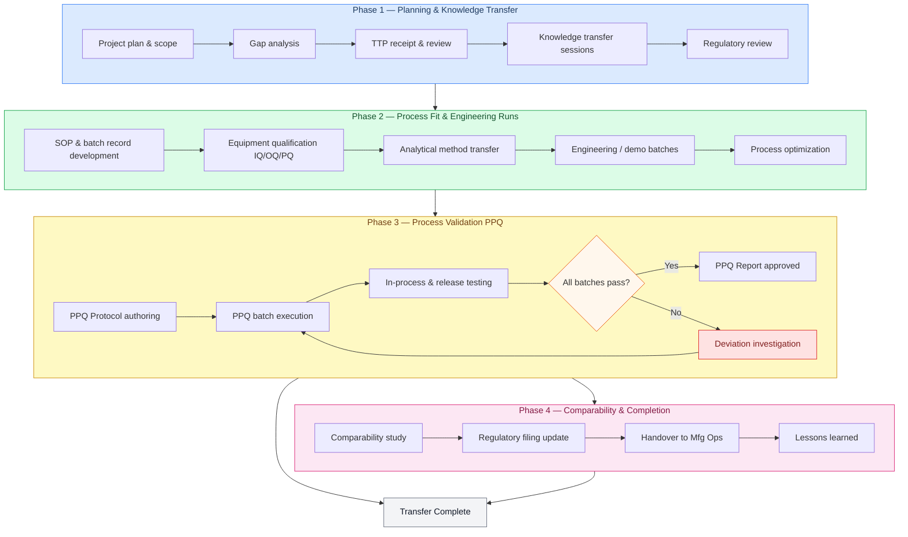
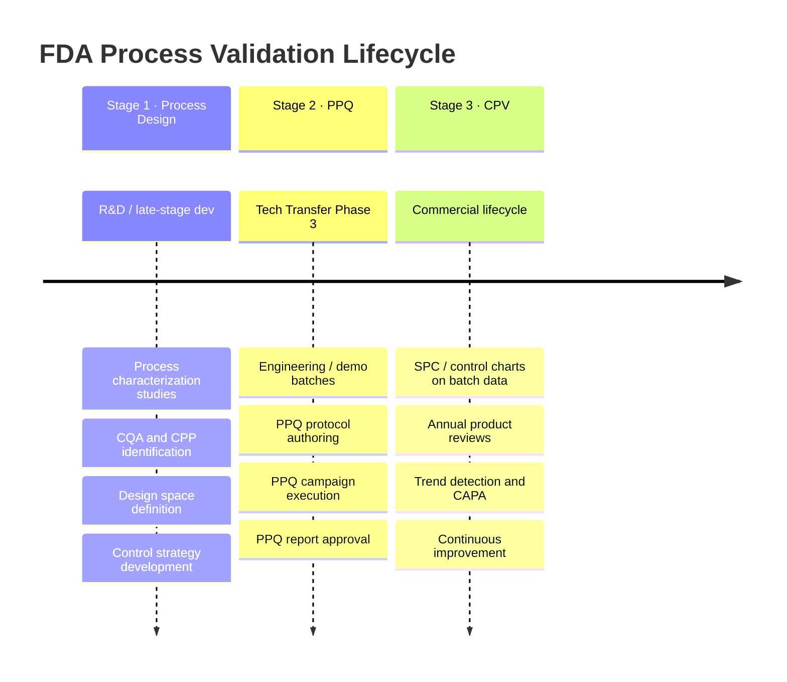

# Tech Transfer Phases

**Backlinks:** [_index.md](../_index.md) | [tech_transfer/overview.md](overview.md)  
**Related:** [tech_transfer/tech_transfer_package.md](tech_transfer_package.md) | [tech_transfer/process_characterization.md](process_characterization.md) | [tech_transfer/comparability_studies.md](comparability_studies.md)

---

## Overview

A tech transfer project typically moves through four phases. The phases are sequential but overlap in practice — Phase 2 activities often begin before Phase 1 is fully closed.

Timeline varies enormously depending on product complexity, regulatory requirements, number of unit operations, and organizational factors. A simple small-molecule solid dosage form might take 12–18 months; a complex biologic could take 3–4 years.

---

## Phase 1: Planning and Knowledge Transfer

**Goal:** Establish the project scope, assemble the team, and transfer process knowledge from sending site to receiving site.

**Key activities:**

- **Project plan** — Define milestones, timelines, resource assignments, and decision gates. This document governs the whole project.
- **Gap analysis** — Compare the process requirements against the receiving site's equipment, capabilities, and existing procedures. Identify what needs to be developed, modified, or procured.
- **TTP receipt and review** — The receiving site reviews the Tech Transfer Package from the sending site and identifies any missing information, ambiguous procedures, or unexplained process behaviors. See: [tech_transfer/tech_transfer_package.md](tech_transfer_package.md)
- **Knowledge transfer sessions** — In-person or virtual meetings where sending site scientists and operators share tacit knowledge — the process behaviors that are "known" but not necessarily written down.
- **Regulatory review** — Determine what is in the current regulatory filing and what changes (if any) to the filing will be required for the transfer.

**Outputs:** Approved project plan, gap analysis report, knowledge transfer meeting minutes.

---

## Phase 2: Process Fit and Engineering Runs

**Goal:** Confirm the process works on the receiving site's equipment, and identify and resolve any site-specific issues before the formal validation campaign.

**Key activities:**

- **SOP and batch record development** — Adapt the process documentation from the TTP to the receiving site's equipment, systems, and conventions. The goal is a complete, GMP-ready batch record.
- **Equipment qualification** — Ensure all manufacturing and testing equipment is IQ/OQ/PQ qualified. Any equipment gaps identified in the Phase 1 gap analysis must be resolved here.
- **Analytical method transfer** — Transfer all analytical test methods to the receiving site's quality control laboratory. Methods must be verified to perform equivalently at the receiving site.
- **Engineering/demo batches** — Non-GMP or partially GMP batches run to test the process on receiving site equipment. These are learning runs — it's acceptable (even expected) to encounter problems here.
- **Process optimization** — If the engineering runs reveal issues (poor yields, unexpected behavior, equipment differences), MSAT resolves them here before committing to the validation campaign.

**Outputs:** Approved batch records and SOPs, qualified equipment, transferred analytical methods, engineering run reports.

---

## Phase 3: Process Validation (PPQ)

**Goal:** Execute a formal, GMP campaign demonstrating that the process consistently produces product meeting all specifications at the receiving site.

This phase maps to **Stage 2 of FDA's Process Validation lifecycle** (2011 guidance: Guidance for Industry — Process Validation: General Principles and Practices).

**Key activities:**

- **PPQ Protocol authoring** — A detailed GMP document specifying: number of batches, acceptance criteria for each unit operation and for the final product, sampling plan, and statistical approach. Must be approved before any PPQ batches are manufactured.
- **PPQ execution** — Manufacturing the defined number of PPQ batches (typically 3, but the number depends on product complexity and regulatory history). Every step documented in real time per the batch record.
- **In-process and release testing** — Full analytical testing per the established specifications. PPQ batches are held until all testing is complete and reviewed.
- **PPQ Report** — Documents whether the acceptance criteria were met for all batches. This is a GMP record subject to regulatory inspection.

**Outputs:** Approved PPQ protocol, executed batch records for PPQ batches, analytical results, approved PPQ report.

**What if a PPQ batch fails?**  
A failing PPQ batch is a significant event. It triggers a deviation investigation, root cause analysis, and a decision: was the failure due to a process issue (requiring process changes and revalidation) or an isolated anomaly (which may allow the validation to proceed with justification)? This decision involves QA, MSAT, and often Regulatory Affairs.

---

## Phase 4: Comparability and Transfer Completion

**Goal:** Demonstrate that product from the receiving site is equivalent in quality to product from the sending site, and formally close the transfer.

**Key activities:**

- **Comparability study** — Analytical comparison of batches from the sending and receiving sites. For biologics, this can be extensive (physicochemical, biological, clinical data). For small molecules, it may be primarily analytical. See: [tech_transfer/comparability_studies.md](comparability_studies.md)
- **Regulatory filing update** — If the transfer involves regulatory changes (new site, new equipment, new process parameters outside the existing filing), the appropriate supplements or notifications must be filed.
- **Handover to Manufacturing Operations** — Training of manufacturing personnel, final hand-off of process ownership, and formal declaration that the transfer is complete.
- **Lessons learned** — Documentation of what went well, what was difficult, and what would be done differently. Used to improve future tech transfers.

**Outputs:** Comparability report, regulatory filings (if applicable), training records, formal transfer completion memo.

---

## Process Validation Lifecycle (FDA 3-Stage Model)

For context, the FDA's 2011 Process Validation guidance defines three stages that extend beyond the tech transfer itself:

| Stage | Description | MSAT involvement |
|---|---|---|
| Stage 1: Process Design | Process development, characterization, and design space definition | Collaboration with R&D/Process Development during late-stage development |
| Stage 2: Process Performance Qualification (PPQ) | Formal validation campaign demonstrating commercial-scale consistency | Primary MSAT responsibility |
| Stage 3: Continued Process Verification (CPV) | Ongoing monitoring of the commercial process to confirm it remains in a state of control | MSAT maintains; annual CPV review reports |

